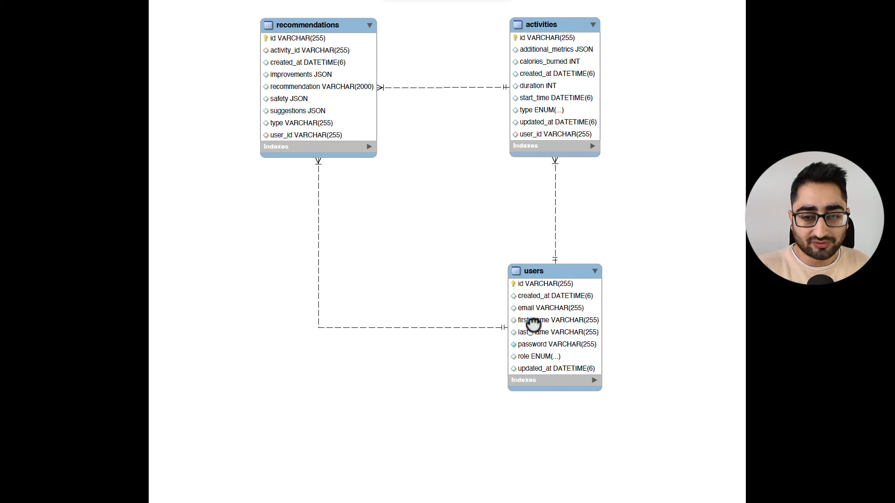

# 🏗️ Database Design & Entity Relationship (ER) Analysis

The system is designed around three core entities: **Users**, **Activities**, and **Recommendations**.

---

### 1. 👤 Users Table

This is the primary entity that stores profile and authentication details.

* **Attributes:**
* `id`: Primary key (UUID/String).
* `email`: Unique identifier for login.
* `password`: Encrypted credentials.
* `firstname` / `lastname`: User's personal name.
* `role`: Defines access levels (likely for Spring Security).
* `created_at` / `updated_at`: Audit timestamps.

### 2. 🏃‍♂️ Activities Table

Tracks physical exercises or fitness logs recorded by the user.

* **Attributes:**
* `id`: Primary key.
* `type`: The kind of activity (stored as an Enum).
* `calories_burned`: Numeric value of energy spent.
* `duration`: Time spent on the activity.
* `additional_metrics`: JSON field for flexible metadata (e.g., steps, distance).
* `user_id`: Foreign key connecting the activity to a specific user.

### 3. 💡 Recommendations Table

Stores insights or suggestions generated for users based on their activities.

* **Attributes:**
* `id`: Primary key.
* `recommendation`: The actual text or content of the suggestion.
* `improvements`: JSON field detailing specific areas to work on.
* `safety`: JSON field for health warnings or precautions.
* `user_id`: Foreign key linking to the user.
* `activity_id`: Foreign key linking to a specific activity that triggered this recommendation.

---

### 🤝 Core Relationships

| Relationship | Type | Logic |
| --- | --- | --- |
| **User ↔ Activities** | **One-to-Many** | One user can log multiple fitness activities over time. |
| **User ↔ Recommendations** | **One-to-Many** | One user can receive many different health recommendations. |
| **Activity ↔ Recommendations** | **One-to-One** | A specific activity log can trigger a specific recommendation insight. |

---

### 🛠️ Developer Notes for Spring Data JPA

* **JSON Fields:** Since the diagram uses `JSON` types for metrics and suggestions, you will need a library like **Hypersistence Utils** or use `@Convert` with a AttributeConverter to map these to Java Maps or Objects.
* **Audit Fields:** Use `@CreatedDate` and `@LastModifiedDate` annotations to automate the `created_at` and `updated_at` fields.

Would you like me to generate the **Java Entity classes** with the correct JPA annotations based on this diagram?