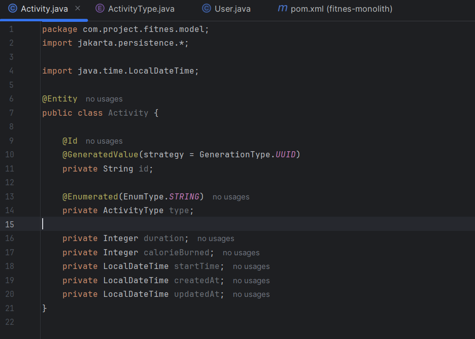
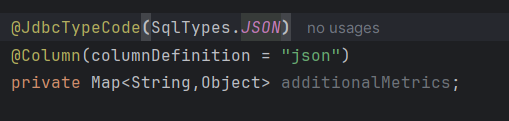
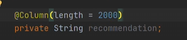

### 🆔 Primary Key Annotations

Used for the `id` field in your **Users**, **Activities**, and **Recommendations** tables.

* **`@Id`**: Marks this field as the **Primary Key** of the entity. Every JPA entity must have one to uniquely identify a row in the database.
* **`@GeneratedValue`**: Defines the strategy used to create new IDs.
* **`strategy = GenerationType.UUID`**: Tells Hibernate to generate a universally unique identifier (a long string like `550e8400-e29b...`). This matches your ER diagram where `id` is a `VARCHAR(255)`.


---

### 📊 Enum Mapping Annotation

Used for the `type` field in the **Activities** table (e.g., WALKING, RUNNING).

* **`@Enumerated(EnumType.STRING)`**: This tells JPA how to store a Java `Enum` in the database.
* **`EnumType.STRING`**: Stores the actual name of the enum (e.g., "RUNNING") as text in the database. This is preferred because it is human-readable and doesn't break if you change the order of your enums later.
* **Without this**: JPA defaults to `ORDINAL`, which stores a number (0, 1, 2). If you add a new activity type at the top of your list later, all your existing data will point to the wrong activity!


---

### 🏗️ Visualizing the Mapping

| Java Annotation | Database Effect | Why we use it |
| --- | --- | --- |
| **`@Id`** | Creates a Primary Key | Ensures no two records are identical. |
| **`GenerationType.UUID`** | Auto-fills a 36-char string | Prevents ID collisions in distributed systems. |
| **`EnumType.STRING`** | Creates a `VARCHAR` column | Makes the database logs easy to read and maintain. |
---


---


In a professional Spring Boot development environment, handling complex data like JSON requires specific Hibernate annotations to ensure the Java `Map` correctly translates to the `JSON` column type shown in your ER diagram.

# 📦 Deep Dive: Mapping JSON in Spring Boot 3+

### 1. `@JdbcTypeCode(SqlTypes.JSON)`

This is a modern Hibernate 6+ annotation that significantly simplifies JSON mapping.

* **Function:** It tells Hibernate to use the JDBC driver's native JSON support.
* **Automatic Conversion:** It automatically handles the conversion between your Java Object (like a `Map` or a custom POJO) and the database's JSON format.
* **Why we use it:** Before this, developers had to write complex "Attribute Converters." Now, Hibernate handles the serialization and deserialization automatically.

---

### 2. `@Column(columnDefinition = "json")`

While `@JdbcTypeCode` handles the Java logic, this annotation handles the **Database Schema** logic.

* **Explicit Definition:** It explicitly tells the database (like PostgreSQL or MySQL) to create this specific column using the `JSON` or `JSONB` data type.
* **Database Optimization:** By defining it as `json` instead of a standard `text` or `varchar`, the database can perform faster lookups and validations on that column.

---

### 3. `private Map<String, Object> additionalMetrics;`

This is your Java representation of the data.

* **Flexibility:** Using a `Map<String, Object>` allows you to store dynamic keys and values (e.g., `{"steps": 5000, "distance": "5km"}`) without changing your Java code or database schema every time a new metric is added.
* **Mapping:** This field directly maps to the `additional_metrics` column in your `activities` table.

---

### 🛠️ Professional Implementation Tip

When using these for your **Fitness App**, ensure your `Activities` entity looks like this to match your ER diagram:

```java
@Entity
@Table(name = "activities")
public class Activity {

    @Id
    @GeneratedValue(strategy = GenerationType.UUID)
    private String id; // Matches PK in ER

    @JdbcTypeCode(SqlTypes.JSON)
    @Column(columnDefinition = "json")
    private Map<String, Object> additionalMetrics; // Matches JSON field in ER

    // Other fields like duration, calories_burned, etc.
}

```

---



---
In a professional Java Full Stack environment, the `@Column` annotation is used to customize how a Java field maps to a specific column in your database table.

### 🏛️ The `@Column(length = 2000)` Annotation

Based on your project's database design for the **Recommendations** table, this annotation is applied to the `recommendation` field.

* **Customizing Column Size**: By default, JPA creates `VARCHAR` columns with a length of **255** characters. Since a fitness recommendation can be quite long, 255 characters would not be enough.
* **Database Schema Mapping**: Setting `length = 2000` tells Hibernate to create the column as `VARCHAR(2000)` in your local database. This matches the requirement shown in your ER diagram.
* **Preventing Data Truncation**: If you try to save a 500-character string into a default 255-character column, the database will throw a "Data Truncation" error. This annotation prevents that by ensuring the "bucket" is big enough.
* **Validation Hint**: It serves as a metadata hint for the application. If you use validation frameworks, it can help ensure the data being sent from the frontend doesn't exceed this limit before it even reaches the database.

---

```java
@OneToMany(mappedBy = "user",cascade = CascadeType.ALL,  orphanRemoval = true)
@JsonIgnore
private List<Activity> activities = new ArrayList<>();

```
---
In a professional Full Stack application, this block of code manages the relationship between a **User** and their multiple **Activities** as shown in your ER diagram.

### 🏛️ Breakdown of the Relationship

#### 1. `@OneToMany(mappedBy = "user"...)`

* **The Relationship**: This defines a **One-to-Many** relationship, meaning one user can have many fitness activity logs.
* **`mappedBy = "user"`**: This tells Hibernate that the `Activity` entity is the "owner" of the relationship. It points to a field named `user` inside your `Activity` class. This prevents the creation of an unnecessary extra join table in your database.

#### 2. `cascade = CascadeType.ALL`

* **Automatic Actions**: This is a powerful "ripple effect" setting. If you perform an action on the User (like saving or deleting), the same action automatically applies to all their Activities.
* **Example**: If you delete a User from the database, all their linked Activities will be deleted automatically without you writing extra code.

#### 3. `orphanRemoval = true`

* **Data Cleaning**: This ensures there are no "homeless" records in your database.
* **Logic**: If you remove an `Activity` object from the `activities` list in Java and save the User, Hibernate will automatically delete that specific activity record from the database table.

#### 4. `@JsonIgnore`

* **Preventing Infinite Loops**: This is a critical Jackson annotation for REST APIs.
* **The Problem**: Without this, when the API tries to convert a User to JSON, it loads the Activities. Each Activity then tries to load its User, which loads the Activities again, leading to a **StackOverflowError**.
* **The Solution**: It tells the API to skip the `activities` list when sending User data to the frontend, keeping the response clean and preventing crashes.

---

```java
@ManyToOne
@JoinColumn(name = "user_id",nullable = false,foreignKey = @ForeignKey(name = "fk_activity_user"))
@JsonIgnore
private User user;
```

In a professional Java Full Stack environment, this code represents the **"child"** side of the relationship between an Activity and a User. While `@OneToMany` was in the `User` class, this code lives inside the `Activity` class to link back to the owner.

### 🏛️ The `@ManyToOne` Relationship Breakdown

#### 1. `@ManyToOne`

* **The Logic**: This declares that **many** activity records can belong to **one** specific user.
* **Database Requirement**: It tells JPA that this entity needs a way to reference the `Users` table.

#### 2. `@JoinColumn(...)`

This annotation is used to physically define the **Foreign Key** column in the `activities` database table.

* **`name = "user_id"`**: This explicitly names the column in your database as `user_id`. This matches exactly with your ER diagram where `user_id` is a `VARCHAR(255)`.
* **`nullable = false`**: This ensures **Data Integrity**. It means an activity cannot exist in the database without being tied to a user. Every workout must have an owner.
* **`foreignKey = @ForeignKey(...)`**: This is a professional touch used to give a custom name (`fk_activity_user`) to the database constraint. It makes debugging easier when looking at database logs or schema errors.

#### 3. `@JsonIgnore`

* **Preventing Recursion**: Just like on the other side of the relationship, this prevents a "Circular Reference".
* **API Efficiency**: When you fetch an Activity via your API, you usually don't want the entire User profile nested inside it. This stops the JSON serializer from following the link back to the User, preventing a loop and keeping the response size small.

---

### 🗄️ Summary of Key Features

| Code Component | Technical Purpose | Project Context |
| --- | --- | --- |
| **`@ManyToOne`** | Defines the link to the parent. | Connects an Activity to its User. |
| **`user_id`** | The physical Foreign Key column. | Maps to the FK in the `activities` table. |
| **`fk_activity_user`** | Logical name for the constraint. | Standard professional naming convention. |
| **`@JsonIgnore`** | Stops JSON Infinite Loops. | Prevents the API from crashing during data fetch. |

