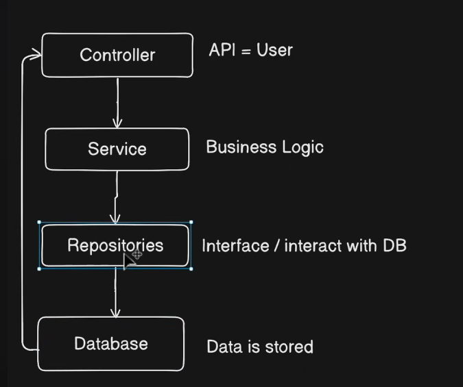
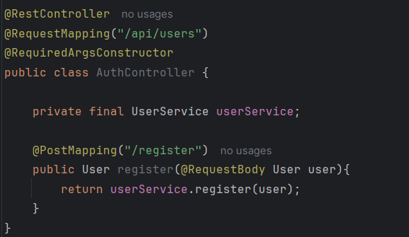
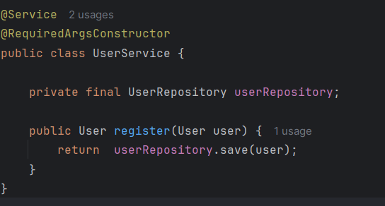
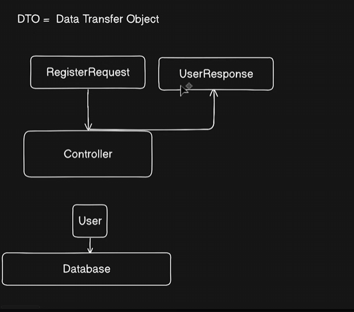
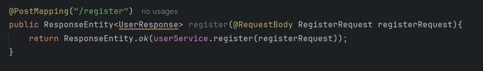

# 🏗️ Spring Boot API Architecture (Layered Pattern)

This is the industry-standard **3-Layer Architecture**. It separates your code into distinct responsibilities to keep it clean, organized, and testable.

### 1️⃣ Controller Layer (The Waiter 🤵)

* **Diagram Label:** `API = User`
* **Role:** The entry point. It handles the "User's" request.
* **What it does:**
* Listens for incoming **HTTP Requests** (GET, POST, PUT, DELETE).
* Validates the request data (checks if inputs are correct).
* **Passes the job** to the **Service Layer**.
* Sends the final **HTTP Response** (status 200 OK, 404 Not Found, etc.) back to the user.
* 🚫 **Rule:** No complex logic here. Just receive and reply.


### 2️⃣ Service Layer (The Chef 👨‍🍳)

* **Diagram Label:** `Business Logic`
* **Role:** The brain of the operation.
* **What it does:**
* Contains the actual **Business Logic** (calculations, rules, conditions).
* Example: "If user buys 2 items, apply 10% discount."
* It processes the data received from the Controller.
* Asks the **Repository Layer** for data if needed.
* 🚫 **Rule:** It never talks directly to the Database (SQL).


### 3️⃣ Repository Layer (The Store Manager 📦)

* **Diagram Label:** `Interface / interact with DB`
* **Role:** The data access layer (DAO).
* **What it does:**
* Directly interacts with the **Database**.
* Performs **CRUD** operations (Create, Read, Update, Delete).
* In Spring Boot, this is often an **Interface** (like `JpaRepository`) that writes the SQL queries for you automatically.
* 🚫 **Rule:** No business logic here. Just fetch and save.


### 4️⃣ Database (The Pantry 🗄️)

* **Diagram Label:** `Data is stored`
* **Role:** Permanent storage.
* **What it does:**
* Stores your actual data tables (e.g., MySQL, PostgreSQL, MongoDB).
* Returns raw data rows to the Repository.


---

### 🔄 The Flow of Data

**1. Request (Downwards ⬇️):**
User → **Controller** (Receives) → **Service** (Processes) → **Repository** (Asks for Data) → **Database** (Finds Data)

**2. Response (Upwards ⬆️):**
**Database** (Returns Data) → **Repository** (Converts to Objects) → **Service** (Finalizes) → **Controller** (Responds JSON) → User

---



# 🎮 Code Explanation: AuthController

This code represents the **Controller Layer** (The Waiter) from your architecture diagram.

### 🏷️ Class Annotations

* `@RestController`: Tells Spring Boot, "Hey, I am a Controller!" It means this class handles incoming web requests and sends back data (JSON).
* `@RequestMapping("/api/users")`: Sets the **base address** for this controller. All endpoints inside here will start with `/api/users`.
* `@RequiredArgsConstructor`: This is **Lombok** magic 🪄. It automatically generates a constructor for the `final` fields (like `userService`). This is how Spring connects (injects) the Service layer into this Controller.

### 🔗 Dependency Injection

```java
private final UserService userService;

```

* This connects the **Controller** to the **Service Layer** (The Chef).
* Because it is `final` and we used the Lombok annotation above, Spring automatically finds the `UserService` and plugs it in here so you can use it.

### ⚡ The Endpoint (Method)

```java
@PostMapping("/register")
public User register(@RequestBody User user) {
    return userService.register(user);
}

```

* **`@PostMapping("/register")`**: Maps **HTTP POST** requests sent to `/api/users/register` to this specific method. (POST is used when creating new data).
* **`@RequestBody`**: The "Unpacker". It takes the raw **JSON data** sent by the user (API) and automatically converts it into a Java `User` object.
* **`userService.register(user)`**: The "Handoff". It passes the data to the Service layer to handle the actual business logic (saving to DB, password hashing, etc.).


---


# 👨‍🍳 Code Explanation: UserService

This code represents the **Service Layer** (The Chef) from your architecture diagram.

### 🏷️ Class Annotations

* **`@Service`**: This tells Spring Boot, "I hold the business logic." It marks this class as a Service component so it can be injected into Controllers.
* **`@RequiredArgsConstructor`**: Just like in the Controller, this is Lombok magic 🪄. It generates the constructor needed to inject the `UserRepository` automatically.

### 🔗 Dependency Injection

```java
private final UserRepository userRepository;

```

* This connects the **Service** to the **Repository Layer** (The Store Manager).
* The Service doesn't know *how* to talk to the database (SQL); it relies on the `userRepository` to handle that dirty work.

### ⚡ The Logic (Method)

```java
public User register(User user) {
    return userRepository.save(user);
}

```

* **The Input**: It receives the `User` object passed down from the `AuthController`.
* **The Logic**: In this simple example, it just passes the user straight to the database.
* *Note:* In a real app, this is where you would add logic like "Check if email exists" or "Encrypt password" before saving.


* **The Action**: `userRepository.save(user)` calls the Repository to actually insert the data into the database table.
* **The Return**: It returns the saved user (often with an auto-generated ID) back up to the Controller.

---

### 🔄 Recap of the Flow So Far

1. **User** sends JSON to `AuthController`.
2. **Controller** unpacks it and calls `userService.register(user)`.
3. **Service** (This code) receives it and calls `userRepository.save(user)`.
4. *(Next Step)* **Repository** will save it to the Database.

---


---
# 📦 DTO (Data Transfer Object) Pattern

This diagram explains how we handle data safely and cleanly using **DTOs**.

### 🤔 What is a DTO?

**DTO = Data Transfer Object**.
It is a plain Java object (POJO) used *only* to carry data between processes. It has no business logic.

### 🛑 The Problem: Why not just use "User"?

In the previous examples, we used the `User` entity directly in the Controller.

* **Security Risk:** The `User` entity often contains sensitive info like `password`, `created_at`, or `id`. You don't want to show the password in the API response! 😱
* **Coupling:** If you change your Database table structure (Entity), you might accidentally break the API for everyone using it.

---

### ✅ The Solution: Use DTOs (As seen in the image)

**1. RegisterRequest (Input DTO) 📥**

* **Diagram Flow:** `RegisterRequest` ➡️ `Controller`
* **Role:** This object defines **exactly** what we need from the user to register them.
* **Example:**
```java
public class RegisterRequest {
    private String username;
    private String password;
    // Notice: NO "id", NO "role", NO "createdAt"
    // We only ask for what is necessary!
}

```


**2. UserResponse (Output DTO) 📤**

* **Diagram Flow:** `Controller` ➡️ `UserResponse`
* **Role:** This object defines **exactly** what we want to show back to the user after they register.
* **Example:**
```java
public class UserResponse {
    private String username;
    private String email;
    // Notice: NO "password" here! 🔒
    // We protect sensitive data by simply not including it.
}

```


**3. The "User" Entity 🗄️**

* **Diagram Flow:** `User` ➡️ `Database`
* **Role:** This is the *actual* database object. It contains everything (`id`, `password`, `roles`, etc.).
* **The Controller's Job:** The Controller (or Service) converts the `RegisterRequest` into a `User` entity to save it, and then converts the saved `User` into a `UserResponse` to send back.

---

### 🔄 The Revised Flow

1. **User (API Client)** sends data matching `RegisterRequest`.
2. **Controller** receives `RegisterRequest`.
3. **App** converts `RegisterRequest` ➡️ `User` (Entity).
4. **Database** saves `User`.
5. **App** converts saved `User` ➡️ `UserResponse`.
6. **Controller** sends `UserResponse` back to client.

**Benefits:**

* 🔒 **Security:** You hide sensitive columns (passwords).
* 🧹 **Cleanliness:** You don't clutter your API with database-specific fields.
* 🔧 **Flexibility:** You can change your database schema without breaking the public API.

---

# After Applying DTO 👇

---

# 🔄 Transformation: Implementing the DTO Pattern

You have successfully refactored your code to separate the **API layer** (what the user sees) from the **Database layer** (how data is stored).

Here is the breakdown of the changes you made and **why** they are important.

---

### 1️⃣ The New "Input" Class (`RegisterRequest.java`)

**What changed:**
Instead of accepting a full `User` entity (which might have fields like `id`, `createdAt`, `role`, etc.), you created a simple class that **only** contains the fields a user needs to sign up.

**Why:**

* **Cleanliness:** A user registering shouldn't provide their own `id` or `createdAt` date. Those are system-generated.
* **Validation:** It allows you to focus only on the data that matters for *registration* (Email, Password, Name).

---

### 2️⃣ The Controller Update (`AuthController.java`)

**What changed:**

```java
// BEFORE (Hypothetically)
public User register(@RequestBody User user) { ... }

// AFTER
public UserResponse register(@RequestBody RegisterRequest registerRequest) { ... }

```

**Why:**

* **Contract Safety:** Your API now has a strict contract. It promises to accept a `RegisterRequest` and return a `UserResponse`.
* **Independence:** If you change your database table (`User` entity) later, this Controller code won't break because it relies on the DTOs, not the Entity directly.

---

### 3️⃣ The Service Layer "Heavy Lifting" (`UserService.java`)

This is where the biggest change happened. The Service now acts as a **Translator** (Mapper).

**Change A: Request ➡️ Entity (Mapping)**

```java
User user = new User(
    null, // ID is null (DB generates it)
    request.getEmail(),
    ...
    // Hardcoded dates (placeholder logic)
    Instant.parse("2025-12-08...").atZone(ZoneOffset.UTC).toLocalDateTime(), 
    ...
);

```

* **Explanation:** You are manually taking data *out* of the `RegisterRequest` and putting it *into* a new `User` entity. You also fill in the blanks (like `null` ID or default dates) that the user didn't provide.

**Change B: Entity ➡️ Response (Mapping)**

```java
private UserResponse mapToResponse(User savedUser){
    UserResponse response = new UserResponse();
    response.setId(savedUser.getId());
    ...
    return response;
}

```

* **Explanation:** After saving to the database, you get a full `savedUser` object (with an ID). You then copy that data into the `UserResponse` object to send back.

---

### 4️⃣ The "Output" Class (`UserResponse.java`)

**What changed:**
You defined a specific structure for the data sent back to the client.

**Why:**

* **Control:** You decide exactly what the frontend receives.
* **⚠️ Security Warning:** In your current code, you included:
```java
private String password;

```


**Critical Note:** The main reason for a `UserResponse` DTO is to **hide** sensitive data. You should **remove** the password field from `UserResponse`. You never want to send the password back to the user! 🔒

---

### 📝 Summary of the Flow

1. **Input:** User sends JSON matching `RegisterRequest`.
2. **Controller:** Passes it to Service.
3. **Service (Map):** Converts `RegisterRequest` ➡️ `User`.
4. **Database:** Saves `User`.
5. **Service (Map):** Converts saved `User` ➡️ `UserResponse`.
6. **Output:** Controller returns `UserResponse`.

### 💡 Recommendation for Next Step

Remove `private String password;` from your `UserResponse.java` file. This immediately makes your API more secure!

---

---
# 📦 What is `ResponseEntity`?

**`ResponseEntity`** is a special class in Spring Boot that represents the **entire HTTP Response**.

When you just return a `User` object, Spring sends the data, but it guesses the rest. When you use `ResponseEntity`, **you** are the boss. You control every part of the message sent back to the user.

### 🎛️ The 3 Parts You Control

1. **🚦 Status Code:** The result signal (e.g., `200 OK`, `404 Not Found`, `201 Created`).
2. **🎫 Headers:** Metadata about the response (e.g., "Content-Type", custom authentication tokens).
3. **📄 Body:** The actual data (your `UserResponse` JSON).

---

### 🔍 Analyzing Your Code

```java
return ResponseEntity.ok(userService.register(registerRequest));

```

1. **`ResponseEntity`**: The wrapper box.
2. **`.ok()`**: This is a static method that automatically sets the **Status Code** to `200 OK`.
3. **`(...)`**: The data inside the parentheses (`userService.register(...)`) becomes the **Body** (the JSON payload).

### ⚖️ Comparison: Why use it?

| Feature | Returning `UserResponse` Directly | Returning `ResponseEntity<UserResponse>` |
| --- | --- | --- |
| **Simplicity** | Easier to write. | Slightly more code. |
| **Status Code** | Always `200 OK` (unless exceptions occur). | **Fully Customizable.** You can send `201`, `400`, `202`, etc. |
| **Headers** | Hard to add custom headers. | **Easy.** You can add cookies or tokens easily. |
| **Best Practice** | Good for simple fetches. | **Standard for professional APIs.** |

### 🚀 Pro Tip: Improving Your Registration Endpoint

Since you are **creating** a new resource (a user), the "perfect" HTTP status code is actually `201 Created`, not `200 OK`.

**Better Implementation:**

```java
// Uses a specific status code for creation
return new ResponseEntity<>(userService.register(registerRequest), HttpStatus.CREATED);

```

* **Result:** The client receives status `201 Created` instead of `200 OK`, which is semantically more correct for a registration API. ✅

---
# After that Created routes and functionality of POST api/activities (Almost same process as above⬆️)
---