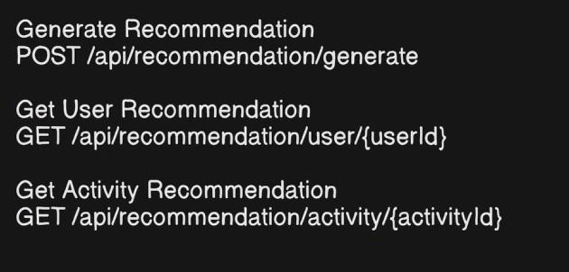
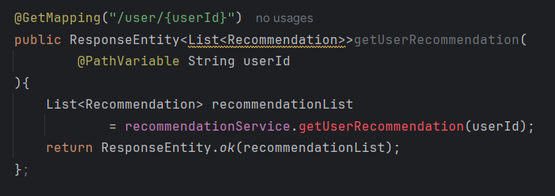

# Recommendations End point


---
# 🔍 Explaining the `generateRecommendation` Call

This code snippet shows a small mismatch (or "bug") between what the Controller receives and what the Service is actually using. Let's break it down.

### 1️⃣ The Request (Input)

```java
public ResponseEntity<Recommendation> generateRecommendation(
    @RequestBody RecommendationRequest request
)

```

* **`@RequestBody RecommendationRequest request`**:
* This part is correct! The Controller is successfully receiving data from the user (like a JSON object with preferences) and storing it in the variable `request`.


### 2️⃣ The Problem Line (The Mismatch) ⚠️

```java
recommendationService.generateRecommendation();

```

* **What is happening:** You are calling the `generateRecommendation()` method in your Service layer **without passing any arguments**.
* **What is ignored:** You received that nice `request` object from the user, but you **didn't pass it** to the service!
* It's like a waiter taking your order ("I want a burger"), walking to the kitchen, and just saying "Cook food!" to the chef, without telling them *what* you ordered. 🍔❌


### 🛠️ How to Fix It

Your Service method likely *needs* the data inside that request to know what kind of recommendation to make. You should pass the variable into the method.

**Corrected Code:**

```java
// Pass the 'request' variable into the service method
Recommendation recommendation = recommendationService.generateRecommendation(request);

```

### 🧠 Why this matters

* **Without the fix:** Your service has to guess what to recommend, or it might just return a generic/random recommendation every time.
* **With the fix:** The service receives the user's specific inputs (from `RecommendationRequest`) and can generate a personalized result.

---


---

# 🔍 Explaining `@PathVariable` and Dynamic URLs

This code snippet introduces a new way to send data to your API: **via the URL path itself**.

### 1️⃣ The Annotation: `@GetMapping("/user/{userId}")`

* **`@GetMapping`**: This handles **HTTP GET** requests (used for fetching/reading data).
* **The Path `"/user/{userId}"**`:
* The part `{userId}` (inside curly braces) is a **Variable (Placeholder)**.
* It tells Spring Boot: *"Accept any request that looks like `/user/john`, `/user/123`, or `/user/abc`."*
* The actual value put there (e.g., "123") is dynamic.


### 2️⃣ The Extractor: `@PathVariable` 🗝️

```java
@PathVariable String userId

```

* **What it does:** It looks at the URL path, finds the part matching `{userId}`, and grabs that value.
* **How it works:**
* If I visit: `GET /api/recommendation/user/55`
* Spring sees `{userId}` matches `55`.
* It injects `"55"` into your `String userId` variable.


### 3️⃣ The Return Type: `List<Recommendation>` 📋

* In your previous examples, you returned a single object (like one `User`).
* Here, you return a `List<Recommendation>`. This makes sense because a single User might have **multiple** fitness recommendations (e.g., "Do Cardio", "Eat Protein", "Sleep More").

---

### 🆚 Comparison: Three Ways to Send Data

You have now used all three major ways to send data to a Controller!

| Annotation | Where does data come from? | Analogy | Best Use Case |
| --- | --- | --- | --- |
| **`@RequestBody`** | The **Body** (hidden JSON payload) | The letter inside the envelope. 📄 | Sending large forms (Registration, Login). |
| **`@RequestHeader`** | The **Header** (metadata) | The stamp/writing on the envelope. ✉️ | Security tokens, User IDs from middleware. |
| **`@PathVariable`** | The **URL** (address bar) | The house address number. 🏠 | Identifying a specific resource (User ID `101`, Post ID `5`). |

### 🔄 The Execution Flow

1. **User Requests:** `GET /api/recommendation/user/user_123`
2. **Controller:** `@PathVariable` grabs `"user_123"`.
3. **Service:** Calls `getRecommendation("user_123")`.
4. **Database:** Finds all recommendations linked to that ID.
5. **Response:** Returns a JSON Array: `[ { "id": 1... }, { "id": 2... } ]`.