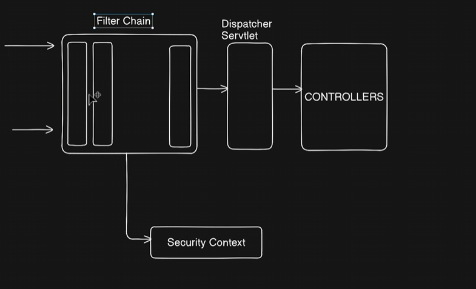

# 🛡️ Spring Security: Beginner's Guide

Spring Security is a powerful framework that secures your application. It acts like a **Security Guard** 👮‍♂️ standing at the door of your API.

### 🔑 The Two Main Pillars

Before writing code, you must understand the difference between these two:

1. **Authentication (AuthN) 🆔**
* **Question:** "Who are you?"
* **Action:** Logging in (Username + Password).
* **Analogy:** Showing your ID card at the airport entrance.


2. **Authorization (AuthZ) 🚧**
* **Question:** "What are you allowed to do?"
* **Action:** Checking permissions (Admin vs. User).
* **Analogy:** Having a "First Class" ticket that lets you into the VIP lounge.


---

### 🧱 How It Works: The Filter Chain

Spring Security works using a **Filter Chain**. Every time a request comes in, it must pass through a series of "Security Filters" before it reaches your Controller.

1. **Request:** User sends `GET /api/admin`.
2. **Filter Wall:** Spring checks:
* Is this user logged in?
* Does this user have the `ADMIN` role?


3. **Result:**
* ✅ **Pass:** Request goes to the Controller.
* 🚫 **Fail:** Returns `401 Unauthorized` (Not logged in) or `403 Forbidden` (Logged in, but wrong permission).


---

### 🧩 Key Components (The Players)

| Component | Role | Description |
| --- | --- | --- |
| **`SecurityFilterChain`** | **The Rule Book 📜** | Defines which URLs are public (open) and which are private (locked). |
| **`UserDetailsService`** | **The Database Finder 🕵️‍♂️** | A service that knows how to load a user from *your* database. |
| **`UserDetails`** | **The ID Card 🪪** | Spring doesn't know your `User` entity. This interface converts your User into a format Spring understands. |
| **`PasswordEncoder`** | **The Scrambler 🍳** | Encrypts passwords so they are never stored as plain text. (e.g., `BCrypt`). |

---

### ⚙️ Basic Configuration (The Code)

In modern Spring Boot (3.x), we use a "Bean" style configuration.

```java
@Configuration
@EnableWebSecurity
public class SecurityConfig {

    @Bean
    public SecurityFilterChain securityFilterChain(HttpSecurity http) throws Exception {
        http
            .csrf(csrf -> csrf.disable()) // 1. Disable CSRF (common for stateless APIs)
            .authorizeHttpRequests(auth -> auth
                .requestMatchers("/api/auth/**").permitAll() // 2. Public Endpoints (Login/Register)
                .requestMatchers("/api/admin/**").hasRole("ADMIN") // 3. Private Admin Endpoints
                .anyRequest().authenticated() // 4. Lock everything else
            )
            // 5. Use Stateless Session (Good for REST APIs/JWT)
            .sessionManagement(sess -> sess.sessionCreationPolicy(SessionCreationPolicy.STATELESS));

        return http.build();
    }
}

```

### 🔒 Password Encoding

**Never** save plain passwords like "123456". Always hash them!

```java
@Bean
public PasswordEncoder passwordEncoder() {
    return new BCryptPasswordEncoder(); // The industry standard
}

```

* **Input:** `password123`
* **Database Stores:** `$2a$10$EixZaYVK1fsbw1ZfbX3OXePaWrn96p...`
* **Verification:** Spring automatically matches the raw input against the hash during login.

---

# Architecture

---


# 🛡️ Spring Security Architecture: The Filter Chain Flow

Based on the diagram you provided, here is exactly how Spring Security protects your application. It acts as a **wall** before your code ever runs.

### 1️⃣ The Request (Incoming Arrows) 📨

* **What it is:** A user sends an HTTP request (e.g., `GET /api/users`).
* **The Diagram:** The arrows on the far left pointing into the "Filter Chain" box.
* **Action:** The request hits the server, but before it reaches your Java code, it is intercepted.

### 2️⃣ The Filter Chain (The Bouncers) 🚧

* **What it is:** A series of security checks (Filters) that run **before** the request reaches the main application.
* **The Diagram:** The large box containing vertical bars (filters) labeled "Filter Chain".
* **Action:** This is the most important part. The request must pass through these filters one by one.
* **Authentication Filter:** Checks "Who are you?" (Looks for a token or session).
* **Authorization Filter:** Checks "Are you allowed here?" (Checks roles like `ADMIN`).
* **Result:** If any filter says **NO**, the request is rejected immediately (401/403 Error). The request never reaches your Controller.


### 3️⃣ Security Context (The ID Holder) 🪪

* **What it is:** A secure storage area where Spring keeps the details of the currently logged-in user.
* **The Diagram:** The box at the bottom connected to the Filter Chain.
* **Action:**
* If a user logs in successfully, their details (User ID, Roles) are saved here.
* Later, if you need to know "who is logged in" inside your Controller, you look inside this **Security Context**.


### 4️⃣ Dispatcher Servlet (The Traffic Cop) 👮

* **What it is:** The front controller of Spring MVC.
* **The Diagram:** The vertical box right after the Filter Chain.
* **Action:**
* If the **Filter Chain** gives the "Green Light" ✅, the request is passed here.
* The Dispatcher Servlet looks at the URL (e.g., `/api/users`) and decides which Controller is responsible for handling it.


### 5️⃣ Controllers (The Destination) 🎯

* **What it is:** Your actual code (e.g., `AuthController`, `RecommendationController`).
* **The Diagram:** The final box on the right.
* **Action:**
* This is where your business logic runs.
* **Crucial Point:** Your Controller code **only** executes if the request successfully survived the entire Filter Chain.


---

### 🔄 Summary of the Flow

1. **Request** arrives.
2. **Filter Chain** stops it and inspects it.
3. **(Optional)** Details are stored in **Security Context**.
4. If safe, it passes to **Dispatcher Servlet**.
5. Dispatcher Servlet sends it to your **Controller**.

---

# 🆔 UserDetails & UserDetailsService

In Spring Security, these two interfaces are the bridge between **your database** and **Spring's security system**.

### 1️⃣ The Problem

Spring Security doesn't know what your database looks like. It doesn't know if you named your user table `User`, `Member`, or `Person`. It doesn't know if the password field is called `password` or `pass_hash`.

**The Solution:** Spring created a standard contract (Interface) that it understands, and you must "translate" your data into that format.

---

### 2️⃣ UserDetails (The "Standard ID Card") 🪪

This is an **interface** that represents the user's information in a way Spring understands.

* **Role:** It tells Spring: "Here is the username, here is the password, and these are the authorities (permissions)."
* **How to use it:** You usually make your existing `User` entity implement this interface.

**Methods you must override:**

* `getUsername()`: Returns the login name.
* `getPassword()`: Returns the hashed password.
* `getAuthorities()`: Returns a list of roles (e.g., "ROLE_USER").
* `isAccountNonExpired()` / `isLocked()`: Boolean flags to check if the user is allowed to login.

**Example Implementation:**

```java
@Entity
public class User implements UserDetails { // 👈 Implements the interface
    
    private String email;
    private String password;

    @Override
    public String getUsername() {
        return email; // We use email as the username
    }

    @Override
    public String getPassword() {
        return password;
    }

    @Override
    public Collection<? extends GrantedAuthority> getAuthorities() {
        return List.of(new SimpleGrantedAuthority("ROLE_USER"));
    }
    
    // ... return true for the boolean flags (isAccountNonLocked, etc.)
}

```

---

### 3️⃣ UserDetailsService (The "Database Fetcher") 🕵️‍♂️

This is a **service interface** with exactly one job: **Load a user from the database**.

* **Role:** When someone tries to log in, Spring calls this service and says: *"Hey, find me a user with the username 'john@example.com'."*
* **The Method:** `loadUserByUsername(String username)`
* **How it works:**
1. It calls your `UserRepository`.
2. It finds your custom `User` entity.
3. It returns it as a `UserDetails` object so Spring can check the password.


**Visual Flow:**

**Example Implementation:**

```java
@Service
@RequiredArgsConstructor
public class CustomUserDetailsService implements UserDetailsService {

    private final UserRepository userRepository;

    @Override
    public UserDetails loadUserByUsername(String email) throws UsernameNotFoundException {
        // 1. Fetch from DB
        return userRepository.findByEmail(email)
                // 2. Return if found, or throw error if not
                .orElseThrow(() -> new UsernameNotFoundException("User not found"));
    }
}

```

---

### 🔄 Summary: The Interaction

1. **Login Attempt:** User sends `email: "bob@gmail.com"` and `password: "123"`.
2. **Spring calls** `UserDetailsService.loadUserByUsername("bob@gmail.com")`.
3. **Your Service** asks the Repository: "Do we have Bob?".
4. **Repository** returns the `User` entity (which acts as `UserDetails`).
5. **Spring** takes the hashed password from that `UserDetails` and compares it with the "123" the user just typed.
* Match? ✅ Login Success.
* No Match? ❌ Login Failed.